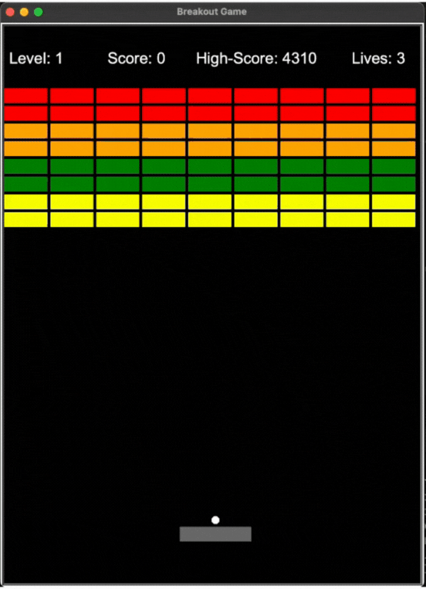

<!-- BREAKOUT GAME -->
# Breakout Game

Clone of the 80s hit game Breakout using Python Turtle. The game consists of several components, each implemented in a separate Python file.



<br>

#
<!-- TABLE OF CONTENTS -->
<details>
  <summary>Table of Contents</summary>
  <ol>
    <li><a href="#Features">Features</a></li>
    <li>
      <a href="#installation">Installation</a>
      <ul>
        <li><a href="#prerequisites">Prerequisites</a></li>
        <li><a href="#steps">Steps</a></li>
      </ul>
    </li>
    <li><a href="#how-to-play-🎮">How to Play</a></li>
    <li>
        <a href="#contributing">Contributing</a>
      <ul>
        <li><a href="#fork-the-repository">Fork the repository</a></li>
      </ul>
    </li>
    <li><a href="#license">License</a></li>
    <li><a href="#acknowledgements">Acknowledgements</a></li>
  </ol>
</details>

<!-- FEATURES -->
## Features

- Control a paddle at the bottom of the screen with left and right arrow keys.
- Pause the game by pressing the space bar.
- Earn points by breaking bricks and try to achieve the highest score.
- Different color bricks, yellow, green, orange and red, have different values.
- Bounce the ball to destroy bricks, and increase your score.
- Levels of difficulty (ball speed) increases as you play to challenge your skills.
- Interactive scoreboard to track your progress. Level, Score and Lives.
- At the end of the game the Highest High-Score is saved.

<!-- INSTALLATION -->
## Installation
#### Prerequisites
* Python 3.x installed on your machine.
* (Optional) A virtual environment for isolated dependencies.


### Steps
1. Clone this repository:

```bash
git clone https://github.com/Garschke/breakout.git
```
2. (Optional) Create and activate a virtual environment:
```bash
python3 -m venv .venv
source .venv/bin/activate   # On Windows use: .venv\Scripts\activate
```
3. Install dependencies (if any):
```bash
pip install -r requirements.txt
```

## How to Play 🎮

1. Run the breakout.py file:

```bash
python3 breakout.py  # Mac & Linux
python breakout.py   # PC
```

2. Use the ⬅️ left and right ➡️ arrow keys to move the paddle and prevent the ball from dropping off the screen, and losing a life.

3. Break all of the bricks on the screen with the ball to level-up and advance on to the next Level, and gain additional lives.

4. Try to achieve the highest score possible by strategically bouncing the ball and breaking the bricks.

5. If the ball misses the paddle and hits the bottom of the screen, you lose a life. The game continues until you have no lives left.

6. Temporarily pause the game play by pressing the space bar, and resume the play by pressing the space bar a second time.

7. When the game is over if you beat the current high-score, your new high-score will be saved in the game.

#### 🎉  Enjoy the game and have fun!

## Contributing
Contributions are welcome!

### Fork the repository
1. Create your feature branch: git checkout -b feature/NewFeature
2. Commit your changes: git commit -m 'Add new feature'
3. Push to the branch: git push origin feature/NewFeature
4. Open a pull request.

## License
This project is licensed under the GPL-3.0 License - see the LICENSE file for details.

## Acknowledgements

- [Python Turtle Graphics](https://docs.python.org/3/library/turtle.html) - The graphics library used for creating the game.
- [Wikipedia - Breakout (video game)](<https://en.wikipedia.org/wiki/Breakout_(video_game)>) - Background information on the Breakout game.